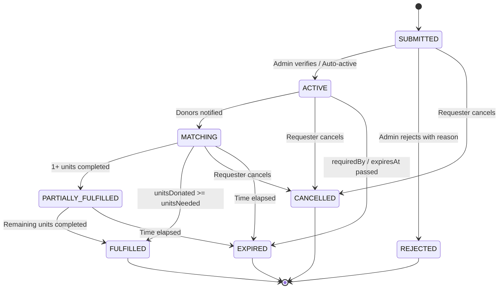
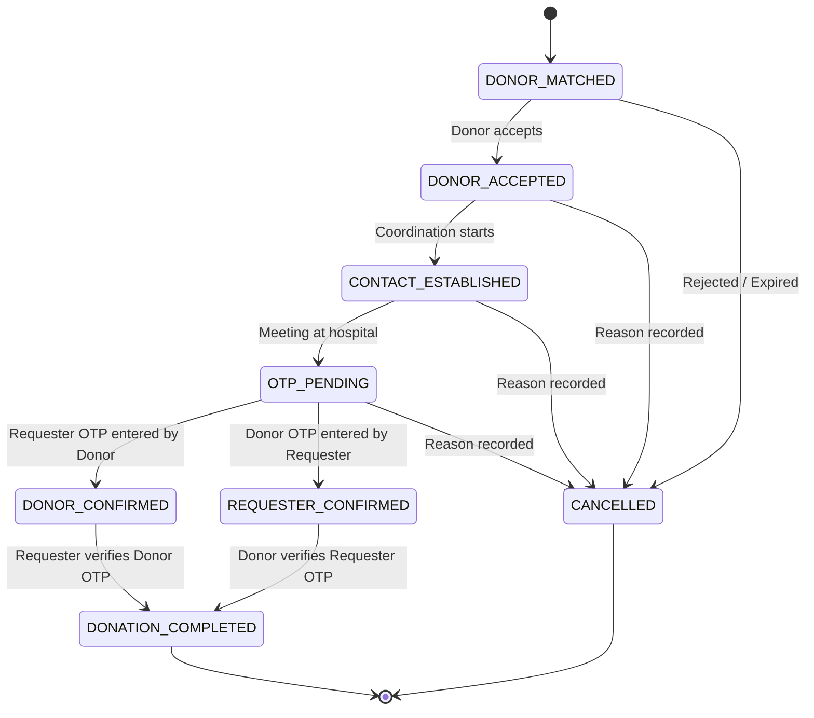

# KURUDHI KODAI — ARCHITECTURAL REFACTORING & SYSTEM SPECIFICATION
**Document Version:** 1.0.0  
**Project:** Kurudhi Kodai (Blood Donation Coordination Platform)  
**Target Environment:** Next.js (App Router), Firebase Auth, Cloud Firestore, Cloud Storage  
**Date:** October 2026

---

## 1. Executive Summary & Product Mission

**Kurudhi Kodai** is a real-time web-based blood donation coordination platform. Its sole primary real-world objective is:
> *Help a person who urgently needs blood connect with a potentially eligible human blood donor quickly and efficiently.*

### Non-Goals (Scope Boundaries)
To keep the architecture lean, cost-free, high-performance, and resilient, Kurudhi Kodai **strictly avoids**:
- Hospital Management Systems (HMS) or electronic health records (EHR).
- Blood bank inventory management as a core prerequisite.
- Medical diagnosis or certified clinical screening (final eligibility remains strictly certified by licensed medical staff).
- Paid third-party APIs (No Twilio/SMS, no WhatsApp Business API, no SendGrid/paid email providers, no Google Maps JavaScript API billing).
- Continuous GPS tracking or invasive device background geolocation.

---

## 2. Comprehensive Codebase Inventory & Current State Audit

### 2.1 File & Route Map

| Path | Purpose | Key Deficiencies Identified |
| :--- | :--- | :--- |
| `firebase/config.js` | Exports only `auth` | Repeated `initializeApp` across almost all pages; no centralized `db` or `storage` export. |
| `context/AuthContext.js` | Auth provider | Lacks unified post-auth hydration (`users/{uid}` check, role loading, donor profile caching, email verification handling). |
| `app/(auth)/signin/page.js` | Sign-in page | Uses `CryptoJS` to encrypt `uid` with `NEXT_PUBLIC_UUID_SECRET` into `localStorage`. Queries donors by `Email`. |
| `app/(auth)/signup/page.js` | Sign-up page | Does not create `users/{uid}` document upon account creation; validation is purely client-side. |
| `app/page.js` | Landing page | Listens in real-time (`onSnapshot`) to entire `donors`, `requests`, and `camps` collections just to display landing page stats. |
| `app/needdonor/page.js` | Create request | Decrypts `uuid` from `localStorage`. Stores unstandardized PascalCase fields. No duplicate check, no area/locality field, no expiry, no emergency fast-track mode. |
| `app/dashboard/page.js` | Donor dashboard | Generates 6-digit OTPs in plain text in client; saves both donor & requester OTP in same document; verifies OTP client-side; N+1 queries across all requests for user donations; deletes cancellations. |
| `app/myrequests/page.js` | Requester dashboard | Exposes plain text OTPs; client verification; lacks state machine enforcement; queries donor by email. |
| `app/admin/page.js` (~1.8k lines) | City admin dashboard | Monolithic page; client-side city enforcement; downloads all collections; lacks indexed server queries; no audit logging. |
| `app/superadmin/page.js` (~3.2k lines) | Superadmin dashboard | Monolithic (3,273 lines); performs all mutations client-side without security rules; unpaginated collection downloads. |
| `app/profile/page.js` | User profile | Handles Base64 & Firebase Storage profile photos; queries donor by email. |
| `app/support/page.js` | Support viewer | Real-time listener on entire `support` collection without any authorization or user role check! |
| `app/api/support/route.js` | Support REST endpoint | **CRITICAL CVE**: Public `GET` returns all support tickets to any unauthenticated caller. |
| `app/camp/page.js` | Blood camp hosting | Lacks lifecycle states (`PENDING`, `APPROVED`, `PUBLISHED`, `COMPLETED`, `CANCELLED`). |
| `components/Navbar.jsx` | Header navigation | Decrypts `localStorage` UID; queries donors by email; fetches profile picture; lacks notification bell. |

---

## 3. Threat Model & Security Vulnerability Remediation

### 3.1 Vulnerability Matrix

```
+---------------------------------------------------------------------------------------------------------+
| Threat / Vulnerability                    | Severity | Root Cause                     | Remediation      |
+---------------------------------------------------------------------------------------------------------+
| 1. Mutual OTP Exposure in Firestore       | CRITICAL | Both OTPs stored in plaintext  | Subcollections / |
|                                           |          | in same readable document      | Hash / Server TX |
+---------------------------------------------------------------------------------------------------------+
| 2. Client-Side OTP Authority              | CRITICAL | React compares strings         | Atomic Firestore |
|                                           |          | and marks donation verified    | Transaction / API|
+---------------------------------------------------------------------------------------------------------+
| 3. NEXT_PUBLIC_UUID_SECRET in localStorage| HIGH     | Pseudo-encryption in client    | Use Auth UID     |
|                                           |          | exposed via NEXT_PUBLIC        | canonical tokens |
+---------------------------------------------------------------------------------------------------------+
| 4. Public Unauthenticated Support API     | HIGH     | GET /api/support returns all   | Auth + Admin-only|
|                                           |          | support tickets with PII       | RBAC enforcement |
+---------------------------------------------------------------------------------------------------------+
| 5. Client-Side Role & City Bypassing      | HIGH     | Role checks only in React      | Firestore Rules  |
|                                           |          | (if user.role === 'admin')     | + Server Claims  |
+---------------------------------------------------------------------------------------------------------+
| 6. Missing Firestore & Storage Rules      | CRITICAL | Zero security rules file;      | Granular rules   |
|                                           |          | open or default read/writes    | deployed in root |
+---------------------------------------------------------------------------------------------------------+
```

### 3.2 Canonical Identity Architecture
- **Elimination of `NEXT_PUBLIC_UUID_SECRET`**: Completely delete reference, crypto-js storage of user credentials, and localStorage token forgery.
- **Identity Source of Truth**: All actions derive the user identity strictly from `auth.currentUser.uid`.
- **Foreign Keys**: Collections link via `createdByUid`, `donorUid`, `requesterUid`. Email is treated solely as a communication field, never a relational key.

---

## 4. Target Architecture & Module Layout

```
Kurudhi-main/
├── app/
│   ├── (auth)/
│   │   ├── signin/page.js
│   │   └── signup/page.js
│   ├── admin/
│   │   ├── page.js                 # Modular admin orchestrator
│   │   └── components/             # Decomposed admin tables & modals
│   ├── api/
│   │   ├── support/route.js        # Secured RBAC support API
│   │   ├── donations/otp/route.js  # Server-side 4-digit OTP verification & state transition
│   │   └── stats/route.js          # Aggregated platform statistics
│   ├── camp/page.js
│   ├── dashboard/page.js           # Refactored Donor dashboard
│   ├── myrequests/page.js          # Refactored Requester dashboard
│   ├── needdonor/page.js           # Standard & Emergency request creator
│   ├── newdonor/page.js            # Donor registration & availability setter
│   ├── profile/page.js             # Simplified profile (no photo)
│   ├── superadmin/                 # Decomposed Superadmin dashboard
│   │   ├── page.js
│   │   └── components/
│   └── layout.js, page.js, etc.
├── components/
│   ├── Navbar.jsx                  # Header with Notification Center & RBAC links
│   ├── NotificationCenter.jsx      # In-app notification drop/modal
│   ├── EmergencyRequestModal.jsx   # < 1-minute quick emergency request
│   └── ui/                         # Radix/Tailwind components
├── context/
│   └── AuthContext.js              # Centralized auth & profile state
├── lib/
│   ├── firebase.js                 # Unified Firebase singleton (auth, db, storage)
│   ├── bloodCompatibility.js       # Centralized medical compatibility rules
│   ├── matchingEngine.js           # 7-level deterministic scoring engine
│   ├── requestStateMachine.js      # Request lifecycle & transitions
│   ├── donationStateMachine.js     # Donation lifecycle & transitions
│   ├── otpService.js               # 4-digit cryptographic OTP generation & verification
│   ├── duplicateDetection.js       # Non-blocking duplicate request detector
│   ├── notifications.js            # In-app + Browser Web Push abstraction
│   ├── auditLogger.js              # Immutable audit logging service
│   └── validationSchemas.js        # Input validation rules & sanitizers
├── firestore.rules                 # Battle-tested production Firestore security rules
├── storage.rules                   # Production storage rules
└── KURUDHI_KODAI_ARCHITECTURE.md   # This specification document
```

---

## 5. Standardized Data Models & Migration Strategy

### 5.1 Canonical Collections

#### 1. `users/{uid}`
```typescript
{
  uid: string;
  email: string;
  displayName?: string;
  role: 'USER' | 'DONOR' | 'ADMIN' | 'SUPERADMIN';
  assignedCity?: string; // For city-level admins
  emailVerified: boolean;
  createdAt: Timestamp;
  updatedAt: Timestamp;
}
```

#### 2. `donors/{uid}`
*(Document ID is equal to Auth UID for O(1) reads; legacy records mapped via compatibility fallback)*
```typescript
{
  uid: string;
  name: string;
  email: string;
  mobile: string;
  whatsapp?: string;
  bloodGroup: 'A+' | 'A-' | 'B+' | 'B-' | 'AB+' | 'AB-' | 'O+' | 'O-';
  gender: 'male' | 'female' | 'other';
  dateOfBirth: string; // YYYY-MM-DD
  state: string; // e.g., 'Tamil Nadu'
  permanentCity: string;
  residentCity: string;
  area?: string; // Locality for Level 4 matching
  availabilityStatus: 'AVAILABLE' | 'UNAVAILABLE';
  availableForEmergency: boolean;
  doNotDisturbUntil?: Timestamp | null;
  lastDonationAt?: Timestamp | string | null;
  nextEligibleAt?: Timestamp | string | null;
  reliabilityStats: {
    requestsReceived: number;
    requestsAccepted: number;
    requestsRejected: number;
    successfulDonations: number;
    cancelledDonations: number;
  };
  createdAt: Timestamp;
  updatedAt: Timestamp;
}
```

#### 3. `bloodRequests/{requestId}`
```typescript
{
  id: string;
  patientName: string; // Privacy protected on public feeds
  patientAge: number;
  gender: 'male' | 'female' | 'other';
  bloodGroup: 'A+' | 'A-' | 'B+' | 'B-' | 'AB+' | 'AB-' | 'O+' | 'O-';
  anyBloodGroupAccepted: boolean;
  unitsNeeded: number;
  unitsDonated: number;
  unitsPending: number;
  hospitalName: string;
  hospitalId?: string;
  hospitalVerificationStatus: 'UNVERIFIED' | 'PENDING' | 'VERIFIED';
  verifiedAt?: Timestamp | null;
  verifiedBy?: string | null;
  state: string;
  city: string;
  area: string; // Locality
  reason: string;
  attenderName: string;
  attenderMobile: string;
  urgencyLevel: 'NORMAL' | 'HIGH' | 'CRITICAL';
  status: 'SUBMITTED' | 'ACTIVE' | 'MATCHING' | 'PARTIALLY_FULFILLED' | 'FULFILLED' | 'EXPIRED' | 'CANCELLED' | 'REJECTED';
  rejectionReason?: string;
  cancellationReason?: string;
  requiredBy?: Timestamp | string;
  expiresAt: Timestamp;
  createdByUid: string;
  createdByEmail: string;
  isEmergency: boolean;
  createdAt: Timestamp;
  updatedAt: Timestamp;
}
```

#### 4. `donations/{donationId}`
```typescript
{
  id: string;
  requestId: string;
  donorUid: string;
  donorName: string;
  donorEmail: string;
  donorBloodGroup: string;
  requesterUid: string;
  unitsPledged: number; // Default 1
  status: 'DONOR_MATCHED' | 'DONOR_ACCEPTED' | 'CONTACT_ESTABLISHED' | 'OTP_PENDING' | 'DONOR_CONFIRMED' | 'REQUESTER_CONFIRMED' | 'DONATION_COMPLETED' | 'CANCELLED';
  donorConfirmed: boolean;
  requesterConfirmed: boolean;
  completedAt?: Timestamp | null;
  cancelledBy?: string | null;
  cancelledAt?: Timestamp | null;
  cancellationReason?: string | null;
  createdAt: Timestamp;
  updatedAt: Timestamp;
}
```

#### 5. `donations/{donationId}/verification/secrets` (Restricted Subcollection)
*Protected by Firestore Security Rules so donor can only see requester's target hash or donor's own OTP, and requester can only see requester's own OTP.*
```typescript
{
  donorOtpHash: string; // SHA-256 or bcrypt hash of 4-digit OTP
  requesterOtpHash: string;
  donorOtpPlainForDonorOnly?: string;
  requesterOtpPlainForRequesterOnly?: string;
  expiresAt: Timestamp; // 10 minutes
  donorAttemptsRemaining: number; // max 3
  requesterAttemptsRemaining: number; // max 3
}
```

#### 6. `notifications/{notificationId}`
```typescript
{
  id: string;
  recipientUid: string;
  type: 'NEW_BLOOD_REQUEST' | 'DONOR_ACCEPTED' | 'REQUEST_UPDATE' | 'DONATION_CONFIRMATION' | 'REQUEST_FULFILLED' | 'REQUEST_CANCELLED';
  title: string;
  message: string;
  requestId?: string;
  donationId?: string;
  read: boolean;
  createdAt: Timestamp;
}
```

#### 7. `bloodCamps/{campId}`
```typescript
{
  id: string;
  organizationType: string;
  organizationName: string;
  organizerName: string;
  organizerMobile: string;
  organizerEmail: string;
  campName: string;
  venue: string;
  city: string;
  state: string;
  campDate: string;
  startTime: string;
  endTime: string;
  expectedDonors: number;
  status: 'PENDING' | 'APPROVED' | 'PUBLISHED' | 'COMPLETED' | 'CANCELLED';
  createdByUid: string;
  createdAt: Timestamp;
  updatedAt: Timestamp;
}
```

#### 8. `supportTickets/{ticketId}`
```typescript
{
  id: string;
  createdByUid?: string;
  name: string;
  email: string;
  phone: string;
  subject: string;
  message: string;
  priority: 'low' | 'normal' | 'urgent' | 'emergency';
  status: 'OPEN' | 'IN_PROGRESS' | 'RESOLVED';
  responseNotes?: string;
  resolvedAt?: Timestamp | null;
  resolvedByUid?: string | null;
  createdAt: Timestamp;
  updatedAt: Timestamp;
}
```

#### 9. `auditLogs/{logId}`
```typescript
{
  id: string;
  actorUid: string;
  actorRole: string;
  action: 'REQUEST_CREATED' | 'REQUEST_VERIFIED' | 'REQUEST_REJECTED' | 'REQUEST_CANCELLED' | 'DONOR_ACCEPTED' | 'DONOR_REJECTED' | 'OTP_VERIFIED' | 'DONATION_COMPLETED' | 'DONATION_CANCELLED' | 'ADMIN_ACTION' | 'ROLE_CHANGED';
  entityType: 'request' | 'donation' | 'user' | 'camp' | 'support';
  entityId: string;
  metadata: Record<string, any>;
  ipAddress?: string;
  timestamp: Timestamp;
}
```

#### 10. `platformStats/global`
```typescript
{
  activeDonors: number;
  successfulDonations: number;
  activeRequests: number;
  fulfilledRequests: number;
  bloodCamps: number;
  updatedAt: Timestamp;
}
```

### 5.2 Legacy Field Compatibility Layer
Existing records use PascalCase (`PatientName`, `BloodGroup`, `UnitsNeeded`, `Verified`, `Email`) and subcollections (`requests/{id}/donations`).
The data access layer implements transparent bidirectional normalization:
- When reading documents: `patientName = data.patientName || data.PatientName || ""`
- When reading status: `status = normalizeStatus(data.status || data.Verified)`
- When reading donor: supports both direct lookup by `donors/{uid}` and indexed query `where("Email", "==", user.email)` as a fallback.

---

## 6. Business Logic & Core Engines

### 6.1 Blood Compatibility Engine (`lib/bloodCompatibility.js`)
Medical transfusion compatibility rules:
- **O-**: Universal Red Blood Cell donor (Compatible with all: O-, O+, A-, A+, B-, B+, AB-, AB+)
- **O+**: Donates to O+, A+, B+, AB+
- **A-**: Donates to A-, A+, AB-, AB+
- **A+**: Donates to A+, AB+
- **B-**: Donates to B-, B+, AB-, AB+
- **B+**: Donates to B+, AB+
- **AB-**: Donates to AB-, AB+
- **AB+**: Donates to AB+ only (Universal Recipient)
- **Any Blood Group**: If `anyBloodGroupAccepted === true` (e.g. for whole blood plasma/dialysis exchange), all donors match.

*Disclaimer: "Final transfusion compatibility must always be cross-matched and clinically verified by qualified medical personnel."*

### 6.2 Deterministic 7-Level Donor Matching Engine (`lib/matchingEngine.js`)

Matching does **not** use AI or paid map APIs. It is scored deterministically:

```
[Level 1: Blood Compatibility]    --> Binary filter (Must pass)
[Level 2: Platform Eligibility]   --> Cooldown filter (>= 90 days since last donation)
[Level 3: Donor Availability]     --> Filter (availabilityStatus == 'AVAILABLE')
[Level 4: Area / Locality Match]  --> Score: +50 points
[Level 5: City Match]             --> Score: +30 points
[Level 6: Recent Activity]        --> Score: +10 points (Active in last 30 days)
[Level 7: Reliability History]    --> Score: +10 points (High completion ratio)
```
Total Score Range: 0 to 100. Donors are ranked and notified in controlled batches (e.g., top 5 highest-scoring donors first, then expanding to next tier).

### 6.3 Request State Machine (`lib/requestStateMachine.js`)



### 6.4 Donation State Machine (`lib/donationStateMachine.js`)



### 6.5 Atomic Unit Management & Race Condition Prevention
When a donation is completed, an atomic Firestore transaction executes:
```typescript
await runTransaction(db, async (tx) => {
  const reqSnap = await tx.get(requestRef);
  const donSnap = await tx.get(donationRef);
  
  if (!reqSnap.exists() || !donSnap.exists()) throw new Error("Missing document");
  
  const req = reqSnap.data();
  const don = donSnap.data();
  
  if (req.status === 'FULFILLED' || req.status === 'CANCELLED' || req.status === 'EXPIRED') {
    throw new Error("Request is no longer active");
  }
  
  if (req.unitsDonated >= req.unitsNeeded) {
    throw new Error("Blood requirement has already been completely fulfilled");
  }
  
  const newUnitsDonated = (req.unitsDonated || 0) + 1;
  const isNowFulfilled = newUnitsDonated >= req.unitsNeeded;
  
  tx.update(requestRef, {
    unitsDonated: newUnitsDonated,
    status: isNowFulfilled ? 'FULFILLED' : 'PARTIALLY_FULFILLED',
    updatedAt: serverTimestamp()
  });
  
  tx.update(donationRef, {
    status: 'DONATION_COMPLETED',
    completedAt: serverTimestamp(),
    updatedAt: serverTimestamp()
  });
});
```

### 6.6 Secure 4-Digit OTP System
1. **Generation**: Generated via `crypto.getRandomValues(new Uint32Array(1))` formatted to 4 digits: `1000` to `9999`.
2. **Short Lifetime**: 10 minutes (`expiresAt = Date.now() + 10 * 60 * 1000`).
3. **Attempt Limit**: Maximum 3 verification attempts. After 3 invalid inputs, the OTP session is locked and must be regenerated.
4. **Isolated Storage**: Plaintext OTP is delivered strictly to the party holding it (Donor sees Donor OTP to verbally tell Requester; Requester sees Requester OTP to verbally tell Donor). Neither party's client receives the counterparty's secret.
5. **Backend Verification**: Verification runs in an isolated transaction or secure route that checks hash / attempts before updating the donation record.

### 6.7 Non-Blocking Duplicate Request Detection
Before submission of a new request, query active requests in the same city for:
- Same hospital
- Same blood group
- Matching patient name or attender contact
If a match is found:
- Warn: *"A similar active blood request already exists at this hospital."*
- Allow user to proceed if it is a genuine separate case, or link to the existing request.

### 6.8 Emergency Request Mode (< 1 Minute)
A dedicated, streamlined flow requiring only:
1. Blood group
2. Units needed
3. Hospital & City/Area
4. Attender contact phone
5. Urgency level ('CRITICAL')
Immediately flags the request as `isEmergency: true`, activates matching, and notifies matching local donors with urgent priority.

---

## 7. Security Rules Architecture

### 7.1 Firestore Security Rules Matrix (`firestore.rules`)
```javascript
rules_version = '2';
service cloud.firestore {
  match /databases/{database}/documents {
    
    function isAuthenticated() {
      return request.auth != null;
    }
    
    function isOwner(uid) {
      return isAuthenticated() && request.auth.uid == uid;
    }
    
    function getUserData() {
      return get(/databases/$(database)/documents/users/$(request.auth.uid)).data;
    }
    
    function isAdmin() {
      return isAuthenticated() && (getUserData().role == 'ADMIN' || getUserData().role == 'SUPERADMIN');
    }
    
    function isSuperAdmin() {
      return isAuthenticated() && getUserData().role == 'SUPERADMIN';
    }

    // Users collection
    match /users/{uid} {
      allow read: if isAuthenticated();
      allow create: if isAuthenticated() && request.auth.uid == uid;
      allow update: if isOwner(uid) && !request.resource.data.diff(resource.data).affectedKeys().hasAny(['role', 'assignedCity']) || isAdmin();
      allow delete: if isSuperAdmin();
    }

    // Donors collection
    match /donors/{donorId} {
      allow read: if isAuthenticated();
      allow create, update: if isAuthenticated() && (request.auth.uid == donorId || request.auth.token.email == resource.data.email || isAdmin());
      allow delete: if isSuperAdmin();
    }

    // Blood Requests collection
    match /requests/{requestId} {
      allow read: if true; // Public view for emergency coordination
      allow create: if isAuthenticated();
      allow update: if isAuthenticated() && (
        resource.data.createdByUid == request.auth.uid || 
        resource.data.uuid == request.auth.uid ||
        isAdmin()
      );
      allow delete: if isSuperAdmin();
      
      match /donations/{donationId} {
        allow read: if isAuthenticated();
        allow create: if isAuthenticated();
        allow update: if isAuthenticated() && (
          resource.data.donorId == request.auth.uid ||
          resource.data.donorUid == request.auth.uid ||
          isAdmin()
        );
        allow delete: if isAdmin();
      }
    }
    
    // Support tickets
    match /support/{ticketId} {
      allow create: if true;
      allow read: if isAdmin() || (isAuthenticated() && resource.data.createdByUid == request.auth.uid);
      allow update: if isAdmin();
      allow delete: if isSuperAdmin();
    }
    
    // Audit logs: Immutable
    match /auditLogs/{logId} {
      allow read: if isAdmin();
      allow create: if isAuthenticated();
      allow update, delete: if false; // Append-only
    }
    
    // Global platform stats
    match /platformStats/{statId} {
      allow read: if true;
      allow write: if isAdmin();
    }
  }
}
```

---

## 8. Step-by-Step Implementation Plan

### Step 1: Core Foundation & Singletons
- Create `@/lib/firebase.js` exporting centralized `auth`, `db`, `storage`.
- Clean up `firebase/config.js` to re-export from `@/lib/firebase.js` for zero disruption.
- Completely remove `NEXT_PUBLIC_UUID_SECRET` from `.env`, code, and build configs.

### Step 2: Auth & Role Architecture
- Enhance `AuthContext.js` with canonical post-auth user hydration:
  `Firebase Auth` -> `ensure users/{uid}` -> `load role` -> `load donor profile` -> `redirect`.
- Update `signin/page.js` and `signup/page.js` to eliminate all localStorage UID encryption and rely solely on `useAuth()`.

### Step 3: Domain Logic Services
- Implement `lib/bloodCompatibility.js` (compatibility matrix).
- Implement `lib/matchingEngine.js` (7-level scoring algorithm).
- Implement `lib/requestStateMachine.js` & `lib/donationStateMachine.js`.
- Implement `lib/otpService.js` (4-digit cryptographic generator & verifier).
- Implement `lib/duplicateDetection.js`.
- Implement `lib/auditLogger.js`.

### Step 4: Profile Picture Removal
- Remove image upload input and handlers in `app/profile/page.js`.
- Remove profile picture rendering in `components/Navbar.jsx`.
- Clean up unused Firebase Storage imports and references.

### Step 5: Notification System & Notification Center
- Create `components/NotificationCenter.jsx` with tabs (All, Unread) and mark-as-read actions.
- Integrate Notification Center bell with badge into `Navbar.jsx`.
- Implement browser Notification Web API permission handler and fallback.

### Step 6: Request Creation & Emergency Mode
- Refactor `app/needdonor/page.js` to use centralized `db`, standard camelCase fields with legacy compatibility, and duplicate request detection.
- Add Emergency Request Mode (< 1 minute fast creation).

### Step 7: Donor Registration & Profile
- Update `app/newdonor/page.js` and `app/profile/page.js` to write directly to `donors/{uid}` with availability fields (`availabilityStatus`, `area`, `dateOfBirth`).

### Step 8: Dashboard & Donation Workflow Refactoring
- Refactor `app/dashboard/page.js`: replace N+1 queries with indexed reads, implement secure 4-digit OTP interface, enforce cooldown days, and preserve historical donation/cancellation records.
- Refactor `app/myrequests/page.js`: update donation confirmation with atomic transactions and state transitions.

### Step 9: Admin & Superadmin Modularization
- Split `app/admin/page.js` (1.8k lines) and `app/superadmin/page.js` (3.2k lines) into modular subcomponents (`AdminRequestsTable`, `AdminDonorsTable`, `AdminCampsTable`, `AdminUsersTable`, `AdminStatsSummary`).
- Enforce server/rules-side city restrictions and indexed Firestore queries.

### Step 10: Security Rules & Route Hardening
- Create `firestore.rules` and `storage.rules`.
- Secure `app/api/support/route.js` and `app/support/page.js` to enforce role-based access.

### Step 11: Unit & Integration Testing
- Create comprehensive tests for blood compatibility, matching score, request/donation state transitions, unit calculation, and OTP logic.

---

## 9. Verification & Success Criteria

1. **Security**: Zero exposed plaintext counterparty OTPs; zero client-side UID encryption; strict rules preventing unauthorized role elevation or ticket snooping.
2. **Functionality**: Smooth end-to-end flow from request creation (standard & emergency) to donor matching, in-app notification, donor acceptance, 4-digit OTP exchange, and atomic unit completion.
3. **Zero Breaking Changes**: Existing records with PascalCase fields and subcollections continue to render and function seamlessly via compatibility adaptors.
4. **Performance**: Elimination of full-collection downloads on landing page; elimination of N+1 subcollection queries in dashboards.
5. **Clean Architecture**: Modular files under 600 lines, centralized configuration, and rich, responsive, mobile-first UI.
